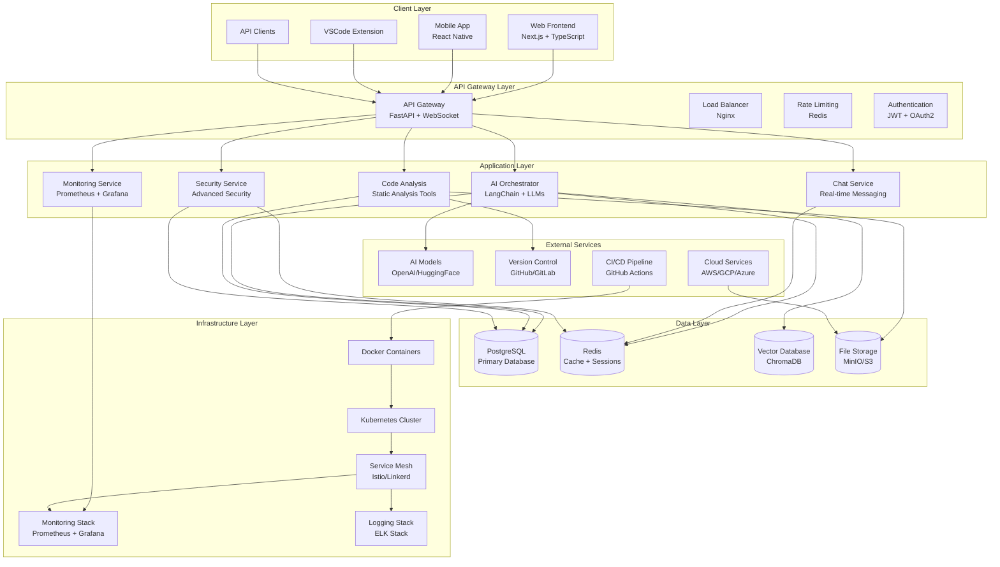
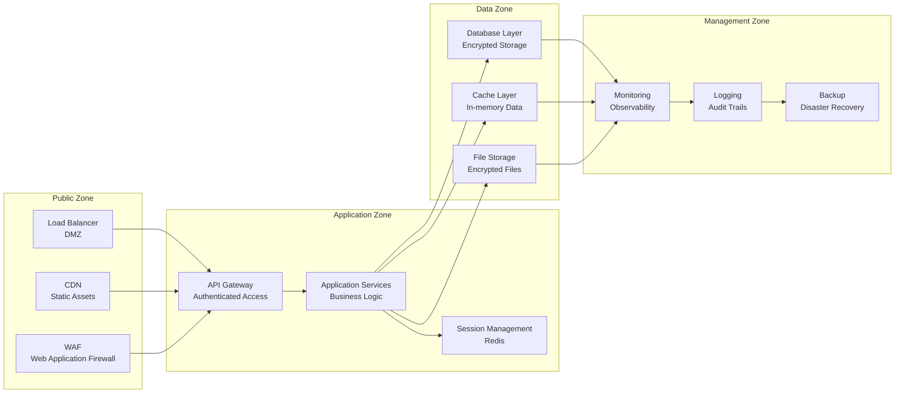
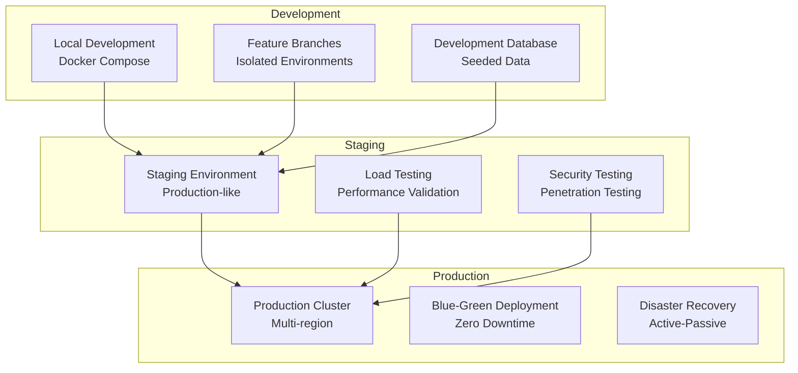
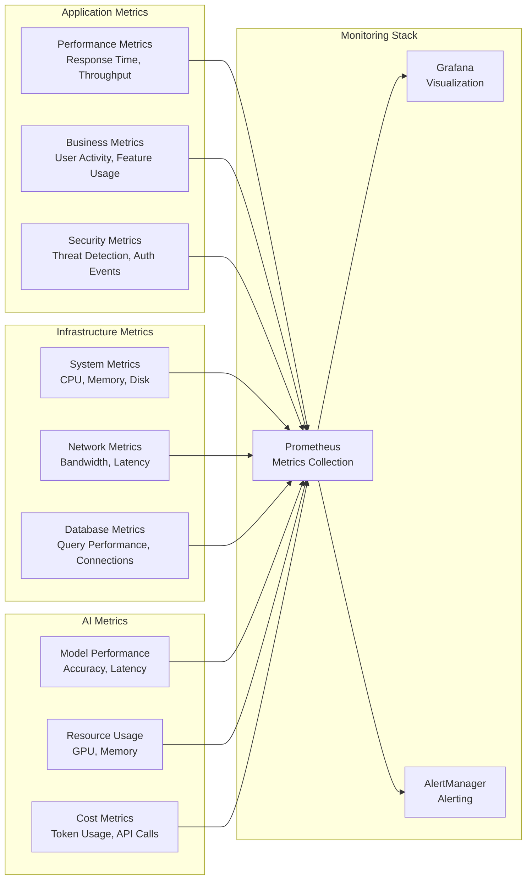

# Samoey Copilot Architecture Documentation

## Overview

Samoey Copilot is a unified AI-powered development platform designed to help developers write better code faster through intelligent assistance, autonomous agents, and real-time collaboration. This document provides a comprehensive architectural overview of the system.

## System Architecture

### High-Level Architecture

### Component Breakdown

#### 1. Client Layer

**Web Frontend**
- **Technology**: Next.js 14 with TypeScript
- **Features**: Real-time chat, code editor integration, dashboard
- **UI Framework**: TailwindCSS with shadcn/ui components
- **State Management**: Zustand for client state, React Query for server state

**Mobile Application**
- **Technology**: React Native with TypeScript
- **Features**: Mobile-optimized interface, push notifications
- **Offline Support**: Local storage with sync capabilities

**VSCode Extension**
- **Technology**: VSCode API with TypeScript
- **Features**: In-editor AI assistance, code completion
- **Integration**: Direct communication with backend services

#### 2. API Gateway Layer

**API Gateway**
- **Technology**: FastAPI with WebSocket support
- **Features**: Request routing, protocol translation, API composition
- **Security**: JWT authentication, rate limiting, CORS handling

**Load Balancer**
- **Technology**: Nginx with Kubernetes Ingress
- **Features**: SSL termination, request distribution, health checks
- **Performance**: Connection pooling, caching headers

**Authentication Service**
- **Technology**: JWT tokens with OAuth2 integration
- **Features**: Multi-factor authentication, role-based access control
- **Security**: Token refresh, session management, audit logging

#### 3. Application Layer

**AI Orchestrator**
- **Technology**: LangChain with multiple LLM providers
- **Features**: Prompt engineering, model routing, response optimization
- **Models**: OpenAI GPT-4, HuggingFace local models, custom fine-tuned models

**Chat Service**
- **Technology**: WebSocket with Redis pub/sub
- **Features**: Real-time messaging, conversation history, typing indicators
- **Scalability**: Horizontal scaling with connection pooling

**Code Analysis Service**
- **Technology**: Static analysis tools with custom parsers
- **Features**: Code quality assessment, security scanning, performance analysis
- **Integration**: GitHub/GitLab webhooks, CI/CD pipeline integration

**Security Service**
- **Technology**: Advanced security patterns with AI-powered threat detection
- **Features**: Input sanitization, prompt injection detection, anomaly detection
- **Compliance**: GDPR, SOC2, HIPAA ready

#### 4. Data Layer

**Primary Database**
- **Technology**: PostgreSQL 15 with TimescaleDB extension
- **Features**: Relational data storage, time-series data, full-text search
- **Performance**: Connection pooling, read replicas, partitioning

**Cache Layer**
- **Technology**: Redis 7 with Redis Stack
- **Features**: Session storage, rate limiting, real-time data
- **Performance**: In-memory caching, pub/sub messaging

**Vector Database**
- **Technology**: ChromaDB with FAISS indexing
- **Features**: Semantic search, embedding storage, similarity matching
- **AI Integration**: Model embeddings, retrieval-augmented generation

**File Storage**
- **Technology**: MinIO with S3 compatibility
- **Features**: File uploads, version control, access control
- **Scalability**: Distributed storage, CDN integration

#### 5. Infrastructure Layer

**Container Platform**
- **Technology**: Docker with Kubernetes
- **Features**: Container orchestration, auto-scaling, self-healing
- **Security**: Pod security contexts, network policies, secrets management

**Service Mesh**
- **Technology**: Istio with mTLS
- **Features**: Service discovery, traffic management, observability
- **Security**: Mutual TLS, service-to-service authentication

**Monitoring Stack**
- **Technology**: Prometheus, Grafana, AlertManager
- **Features**: Metrics collection, visualization, alerting
- **Integration**: Business metrics, SLA monitoring, anomaly detection

**Logging Stack**
- **Technology**: Elasticsearch, Logstash, Kibana (ELK)
- **Features**: Log aggregation, search, analysis
- **Compliance**: Audit trails, security event logging

## Security Architecture

### Security Zones

### Security Controls

**Authentication & Authorization**
- Multi-factor authentication (MFA)
- Role-based access control (RBAC)
- JWT tokens with short expiration
- OAuth2 integration with identity providers

**Data Protection**
- End-to-end encryption (TLS 1.3)
- Database encryption at rest
- File storage encryption
- Secure key management with HashiCorp Vault

**Network Security**
- Zero-trust network architecture
- Micro-segmentation with Kubernetes Network Policies
- DDoS protection and rate limiting
- Web Application Firewall (WAF)

**Application Security**
- Input validation and sanitization
- SQL injection and XSS protection
- CSRF protection with secure tokens
- Security headers implementation

**AI Security**
- Prompt injection detection
- Model output validation
- Adversarial attack protection
- AI model security monitoring

## Deployment Architecture

### Environments

### Deployment Strategies

**Blue-Green Deployment**
- Zero-downtime deployments
- Instant rollback capabilities
- Traffic shifting with gradual rollout
- Health checks and automatic failover

**Canary Deployment**
- Gradual traffic exposure (5% → 50% → 100%)
- Real-time monitoring and metrics
- Automated rollback on failure
- A/B testing capabilities

**Multi-Region Deployment**
- Geographic distribution for low latency
- Active-active replication
- Disaster recovery and failover
- Compliance with data residency requirements

## Performance Architecture

### Scalability Strategy

**Horizontal Scaling**
- Auto-scaling based on CPU/memory metrics
- Queue-based processing for async tasks
- Database read replicas for query scaling
- CDN for static asset delivery

**Vertical Scaling**
- Resource allocation optimization
- Memory management for AI models
- Database performance tuning
- Cache optimization strategies

### Performance Optimization

**Frontend Optimization**
- Code splitting and lazy loading
- Image optimization and WebP format
- Browser caching strategies
- Progressive Web App (PWA) features

**Backend Optimization**
- Database query optimization
- Connection pooling and reuse
- Caching strategies at multiple levels
- Asynchronous processing patterns

**AI Model Optimization**
- Model quantization and pruning
- Batch processing for inference
- Model caching and preloading
- Hardware acceleration (GPU/TPU)

## Monitoring and Observability

### Metrics Collection

### Alerting Strategy

**Critical Alerts**
- Service downtime (P0)
- Security breaches (P0)
- Data loss events (P0)
- Performance degradation > 90% (P1)

**Warning Alerts**
- High error rates (>5%) (P2)
- Resource utilization (>80%) (P2)
- Security events (P2)
- Performance degradation (>50%) (P2)

**Info Alerts**
- Deployments and changes (P3)
- Resource utilization (>60%) (P3)
- Business metrics anomalies (P3)

## Integration Architecture

### Third-Party Integrations

**AI Model Providers**
- OpenAI GPT-4/GPT-3.5
- HuggingFace Transformers
- Anthropic Claude
- Custom fine-tuned models

**Development Tools**
- GitHub/GitLab integration
- VSCode extension API
- Jira/Asana project management
- Slack/Microsoft Teams notifications

**Cloud Services**
- AWS/GCP/Azure infrastructure
- CDN providers (Cloudflare, Fastly)
- Email services (SendGrid, SES)
- Storage services (S3, MinIO)

### API Architecture

**REST API**
- RESTful design principles
- OpenAPI 3.0 documentation
- Version management (v1, v2)
- Rate limiting and throttling

**WebSocket API**
- Real-time communication
- Event-driven architecture
- Connection management
- Message queuing

**GraphQL API**
- Flexible data queries
- Single endpoint design
- Strong typing
- Subscription support

## Disaster Recovery and Business Continuity

### Backup Strategy

**Data Backups**
- Daily full database backups
- Hourly incremental backups
- Real-time replication for critical data
- Off-site storage with encryption

**Configuration Backups**
- Infrastructure as Code (IaC) versioning
- Configuration management in Git
- Secrets management with rotation
- Environment configuration backups

### Recovery Procedures

**Incident Response**
- Automated incident detection
- Runbooks for common scenarios
- Communication protocols
- Post-incident analysis

**Disaster Recovery**
- Multi-region deployment
- Active-passive failover
- Data recovery procedures
- Service restoration priorities

## Future Architecture Evolution

### Planned Enhancements

**Microservices Architecture**
- Service decomposition
- Independent deployment
- Technology diversity
